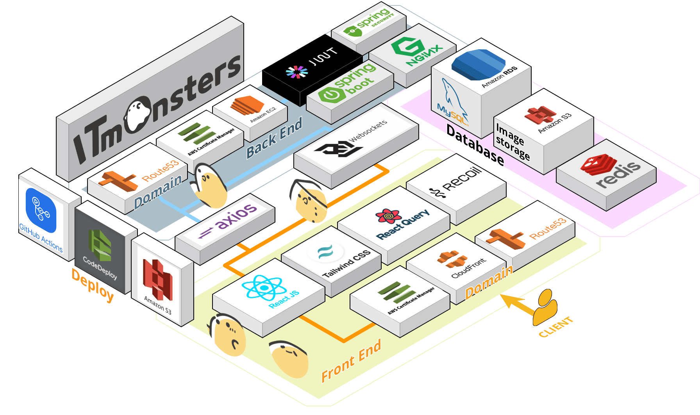

# IT Monsters

 

## 🎃 서비스 소개

  
아무나 매칭되는 랜덤 매칭에 지겨우신 프로젝트 팀!
소통이 안되는 팀원에 지쳐버린 프로젝트 팀!
- 필요한 능력을 가진 참가자를 게시글을 통해 모집해보세요! 
- 팀장님께서는 참가신청을 통해 요청한 사람의 전문성을 확인하고 능력을 갖춘 분이라면
 수락을 통해 팀으로 합류가 가능합니다!

내 능력을 제대로 발휘할 수 있는 팀을 찾고 싶은 개발자!
기가막힌 아이디어를 찾아 도전하고 싶은 개발자!
- 자신의 기록들을 공유하고 전문성을 뽐내보세요.
- 마음에 드는 모집 게시글을 저장하고 참여하고 완료한 프로젝트는 기록으로 남길수 있어요!

IT몬스터즈와 함께 팀을 꾸리고 프로젝트의 세계로 모험을 떠나보세요🏃‍♂️🏃

 

## ✈️ 바로가기

📍[Home Page](https://it-monsters.co.kr/) 
📍[Youtube](https://youtu.be/iyCul1aOxAE)

 

## 🗓️ 프로젝트 기간
2022년 8월 28일 ~2022 년 10월 8일

 

## 👔 우리팀 소개

**`Front-End`** 
- 노진서(Vice Leader) [@bennoholik](https://github.com/bennoholik)
- 원중희 [@wndgml13](https://github.com/wndgml13)
- 황태영 [@hty0525](https://github.com/hty0525)
  
**`Back-End`**
- 전지만(Project Leader) [@Camof1ow](https://github.com/Camof1ow)
- 이원규 [@oneqrhee](https://github.com/oneqrhee)
- 이동규 [@dds1q](https://github.com/dds1q)
- 김진무 [@kimjinmoo91](https://github.com/kimjinmoo91)

**`UI-UX Design`**
- 윤정아

**`Marketing Design`**
- 김소정

 

## ⌨️ 기술스택

### FrontEnd

![Recoil](https://img.shields.io/badge/Recoil-007af4.svg?style=for-the-badge&logo=data:image/svg+xml;base64,PHN2ZyBpZD0iQ2FscXVlXzEiIGRhdGEtbmFtZT0iQ2FscXVlIDEiIHhtbG5zPSJodHRwOi8vd3d3LnczLm9yZy8yMDAwL3N2ZyIgdmlld0JveD0iMCAwIDI1NS4yMSA2MjMuOTEiPjxkZWZzPjxzdHlsZT4uY2xzLTF7ZmlsbDp3aGl0ZX08L3N0eWxlPjwvZGVmcz48cGF0aCBjbGFzcz0iY2xzLTEiIGQ9Im03NC42MiAyNzcuNDYgMS4yNC0uMTMgMzQuNzgtMy4yOC01My40Ny01OC42NkE5Ni40NyA5Ni40NyAwIDAgMSAzMiAxNTAuM0gzYTEyNS4zIDEyNS4zIDAgMCAwIDMyLjggODQuNTdaTTE3Ny4xMyAzNDdsLTM2IDMuNCA1My4zMiA1OC41MUE5Ni40MSA5Ni40MSAwIDAgMSAyMTkuNjMgNDc0aDI4LjkyYTEyNS4yOCAxMjUuMjggMCAwIDAtMzIuNzYtODQuNTdaIi8+PHBhdGggY2xhc3M9ImNscy0xIiBkPSJNMjUzLjY5IDIzMS42OGMtNi4zMy0zMS4zLTMwLjg5LTU0LjA5LTYyLjU3LTU4LjA3bC02LjM1LS43OWE0OS42MSA0OS42MSAwIDAgMS00My4zNS00OS4xM3YtMjBhNTIuNzUgNTIuNzUgMCAxIDAtMjguOTEtLjM2djIwLjM4YTc4LjU2IDc4LjU2IDAgMCAwIDY4LjY1IDc3LjgybDYuMzYuOGMyMy4yNCAyLjkyIDM0Ljc4IDIwIDM3LjgzIDM1LjFzLS45MyAzNS4zMi0yMS4yMiA0N2E3My44MSA3My44MSAwIDAgMS0zMC4wNiA5LjYybC05NS42NiA5YTEwMi40NSAxMDIuNDUgMCAwIDAtNDEuOCAxMy4zOEM5IDMzMi40NS00LjgxIDM2MyAxLjUyIDM5NC4yOXMzMC44OSA1NC4wOCA2Mi41NyA1OC4wNmw2LjM1LjhhNDkuNiA0OS42IDAgMCAxIDQzLjM1IDQ5LjEydjE4YTUyLjc1IDUyLjc1IDAgMSAwIDI4LjkxLjI2di0xOC4yNmE3OC41NSA3OC41NSAwIDAgMC02OC42NS03Ny44MWwtNi4zNi0uOGMtMjMuMjQtMi45Mi0zNC43OC0yMC4wNS0zNy44My0zNS4xMXMuOTMtMzUuMzIgMjEuMjItNDdhNzMuNjggNzMuNjggMCAwIDEgMzAuMDYtOS42M2w5NS42Ni05YTEwMi40NSAxMDIuNDUgMCAwIDAgNDEuOC0xMy4zOGMyNy42NS0xNi4wMiA0MS40LTQ2LjU0IDM1LjA5LTc3Ljg2WiIvPjwvc3ZnPg==&logoColor=white)

### Deploy

### Tools

 

## 🛠 프로젝트 아키텍처

 

## 🔑 기술 스택 도입 배경

**TypeScript**

- 코드 작성시 형변환에 관련한 오류를 명확한 타입 지정을 통해 미리 예방 가능하므로 생산성의 향상을 도모하기 위해 도입하였습니다.

**ReactQuery**

- 각 페이지 별로 필요한 데이터를 바로 가지고 올수있어서 상태관리가 필요없는 컴포넌트에 한하여 리엑트 쿼리를 적용하여 처리할 수 있도록 하였습니다.

**Recoil**

- 다른 전역 상태 관리 툴인 Redux에 비해  리소스를 덜 사용하며 렌더링시의 부담을 덜고 안정적인 전역상태관리를 위하여 도입하게 되었습니다.

**Tailwind CSS**

- 코드의 가독성과 적응 하는데에 시간이 걸리긴 하였지만, Tailwind CSS의 Utility-First 컨셉 덕분에  편리하고 쉽고 빠르게 원하는 디자인을 개발할수 있어서 도입하게 되었습니다.

 

## ⚙️ 트러블 슈팅
1. **✔️WEB socket 호출 이슈**

      채팅방에서 채팅입력창에 입력할때마다 웹소켓이 계속 호출되는 이슈
      
      `문제확인`
      
      채팅방에 들어갈때, 채팅 입력을 할때마다 계속해서 리렌더링이 되면서 web socket을 호출되는 것이라고 판단하였다.
      
      `방법도출`
      
      1. useRef를 이용하여 엔터를 입력했을 경우와 전송 버튼눌렀을 때만 web socket이 호출 되게 만들어서 웹소켓 호출 빈도를 줄였다.
      2. 하지만 여전히 채팅을 보낼때마다 웹소켓이 호출된다는 것 잘못된 방식이라고 판단하였다.
      3. 처음 채팅을 도입 시도할때 로직을 보면 채팅 방에 입장할때마다 SockJs에 연결하고 구독하고 구독해제 하는 방식을 쓰고 있었다.
      4. 로그인 후 바로 웹소켓을 연결하고 채팅방들어갈때마다 구독하는 방식으로 변경하였다.

 

## 🔎 주요기능

 

**팀원 모집 게시글 작성**

 

  모집 게시글 작성시 원하는 기술 스택과 함께 필요한 인원을 설정하여 참여할 인원들이 프로젝트 내용에 대해 확인 할 수 있도록 합니다.

---

**모집 요청 시 알림과 팀원**

     

- 요청된 게시글에 지원요청을 알림을 통해 확인이 가능하며 개인페이지의 참여자의 보유 기술 스택 및 포트폴리오 확인 가능합니다.
- 게시글 작성자는 확인한 정보를 통해 승인과 거절을 할 수 있습니다.

---

**실시간 채팅기능**

   

- 승인을 통해 가입된 팀원은 채팅창에 참여할 수 있습니다.
- 참가중인 멤버를 확인 할 수 있고 프로필을 통해 참가중인 멤버의 개인 페이지와 보유 기술스택 포트폴리오등을 확인 가능합니다.
- 나가기 버튼을 통해 프로젝트팀에서의 도중하차 결정을 내릴 수 있습니다.

---

**게시글 검색기능 및 필터**

     

- 적용된 필터를 통한 빠른 검색이 가능합니다.

  

- 제목으로 모집 게시글 검색이 가능합니다.

 

## 💼 업무 분담
| 이름   | 담당                                                                                                                                                                                                                                                           |
| ------ | -------------------------------------------------------------------------------------------------------------------------------------------------------------------------------------------------------------------------------------------------------------- |
| 노진서 | 1. 로그인, 회원가입, 아이디찾기, 소셜로그인 (네이버, 카카오, 구글), 반응형,  검색 필터링, 전체 검색  2. 게시글 작성, 알림,  마이페이지 조회 및 수정, 유저 정보 페이지 조회, 실시간 채팅   3. 배포 환경구축 (Github Action, AWS s3, CloudFront, Route 53) |
| 원중희 | 게시글 상세 페이지 CRUD                                                                                                                                                                                                                                        |
| 황태영 | 메인페이지, 프로젝트 레이아웃                                                                                                                                                                                                                                  |

 

